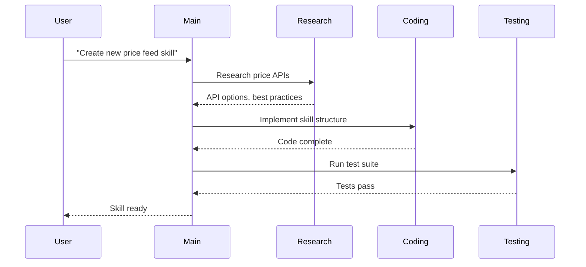
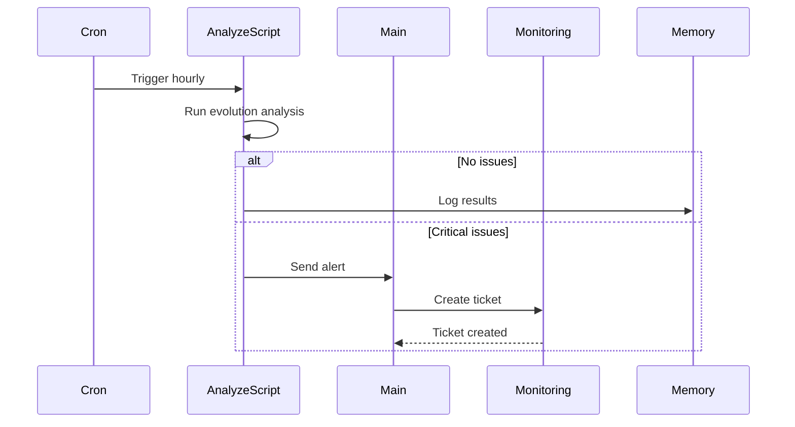

# Multi-Agent Collaboration Design

Architecture for how agents collaborate in the Moltbot ecosystem.

## Overview

This document defines the multi-agent collaboration patterns used for skill development and execution. The system uses a **hierarchical orchestration model** with a main session handling high-level decisions and sub-agents handling specific tasks.

## Architecture

```
┌─────────────────────────────────────────────────┐
│              Main Session (Orchestrator)         │
│  - High-level decisions                         │
│  - Task decomposition                           │
│  - Result aggregation                           │
│  - Alert handling                               │
└───────────────────┬─────────────────────────────┘
                    │
                    │ sessions_send / handoff
                    ▼
┌─────────────────────────────────────────────────┐
│              Sub-Agent Sessions                  │
│  - Research Agent: Web search, summarization    │
│  - Coding Agent: Implementation, testing        │
│  - Analysis Agent: Data processing, patterns    │
│  - Monitoring Agent: Health checks, alerts      │
└─────────────────────────────────────────────────┘
```

## Communication Patterns

### 1. Direct Task Delegation

**Main → Sub-agent:**
```python
# Main session spawns sub-agent for research
await sessions_send(
    session_id="research-agent",
    message={
        "task": "research_dex_apis",
        "params": {"dex": "ekubo", "depth": "detailed"},
        "callback": "main-session"
    }
)
```

**Sub-agent → Main:**
```python
# Sub-agent returns results to main session
await sessions_send(
    session_id="main-session",
    message={
        "result": research_results,
        "task_id": "research_dex_apis",
        "status": "complete"
    }
)
```

### 2. Event-Driven Alerts (Cron → Main)

When cron triggers an analysis that finds critical issues:

```python
# analyze.py script
if issues_found:
    await sessions_send(
        session_id="agent:main:main",
        message={
            "alert": "skill_evolution_critical",
            "data": {
                "issues": critical_issues,
                "timestamp": timestamp,
                "recommendations": fixes
            }
        }
    )
```

### 3. Handoff Protocol

**Successful Handoff:**
```python
async def handoff_to_specialist(skill_task: dict) -> str:
    """Hand off task to appropriate sub-agent."""
    skill_type = skill_task["type"]
    
    agent_map = {
        "research": "agent:main:subagent:research",
        "coding": "agent:main:subagent:coding", 
        "testing": "agent:main:subagent:testing",
        "analysis": "agent:main:subagent:analysis"
    }
    
    agent_id = agent_map.get(skill_type, "agent:main:subagent:general")
    
    # Create handoff message
    handoff = {
        "handoff_from": "orchestrator",
        "handoff_to": agent_id,
        "task": skill_task,
        "priority": skill_task.get("priority", "normal"),
        "deadline": skill_task.get("deadline")
    }
    
    return agent_id
```

## Agent Roles & Responsibilities

### Main Orchestrator
- **Session ID**: `agent:main:main`
- **Responsibilities**:
  - Receive user requests
  - Decompose complex tasks
  - Spawn sub-agents for specialized work
  - Aggregate results
  - Handle errors and retries
  - Send final responses

### Research Agent
- **Session ID**: `agent:main:subagent:research`
- **Responsibilities**:
  - Web searches (Brave, Tavily)
  - API documentation review
  - Summarization
  - Knowledge base updates
- **Tools**: web_search, web_fetch

### Coding Agent
- **Session ID**: `agent:main:subagent:coding`
- **Responsibilities**:
  - Implement skill features
  - Fix bugs
  - Refactor code
  - Write tests
- **Tools**: exec, read, write, edit

### Analysis Agent
- **Session ID**: `agent:main:subagent:analysis`
- **Responsibilities**:
  - Data analysis
  - Pattern detection
  - Metric calculation
  - Evolution analysis
- **Tools**: python3 scripts, data processing

### Monitoring Agent
- **Session ID**: `agent:main:subagent:monitoring`
- **Responsibilities**:
  - Health checks
  - Alert processing
  - Log analysis
  - Cron trigger handling

## Workflow Examples

### Example 1: New Skill Development



### Example 2: Hourly Evolution Analysis



### Example 3: Research Request

```
User: "Research Ekubo API for whale tracking"

1. Main session receives request
2. Spawns Research sub-agent with task:
   - Query: "Ekubo API documentation whale tracking"
   - Sources: Brave, Tavily
   - Output: Summary + API endpoints
3. Research agent:
   - Searches web
   - Fetches documentation
   - Extracts key endpoints
   - Returns structured summary
4. Main session:
   - Formats results
   - Adds to knowledge base
   - Responds to user
```

## Session Naming Convention

```
Format: agent:{type}:{name}:{id}

Examples:
- agent:main:main              # Main orchestration session
- agent:main:subagent:research # Research specialist
- agent:main:subagent:coding   # Coding specialist
- agent:main:subagent:analysis # Analysis specialist
- agent:main:subagent:48fe4... # Ephemeral sub-agent
```

## Error Handling

### Sub-agent Failure
```python
async def run_with_retry(agent_id: str, task: dict, max_retries: int = 3):
    for attempt in range(max_retries):
        try:
            result = await sessions_send(agent_id, task)
            return result
        except Exception as e:
            if attempt == max_retries - 1:
                await escalate_to_main(f"Sub-agent {agent_id} failed: {e}")
            await asyncio.sleep(2 ** attempt)  # Exponential backoff
```

### Timeout Handling
```python
async def run_with_timeout(agent_id: str, task: dict, timeout_seconds: int = 300):
    try:
        return await asyncio.wait_for(
            sessions_send(agent_id, task),
            timeout=timeout_seconds
        )
    except asyncio.TimeoutError:
        await sessions_send(agent_id, {"cancel": task["task_id"]})
        raise TimeoutError(f"Agent {agent_id} timed out")
```

## State Management

### Shared Context
```python
# memory/shared_context.json
{
    "active_tasks": {},
    "agent_status": {
        "research": "idle",
        "coding": "busy",
        "analysis": "idle"
    },
    "pending_results": {},
    "alerts": []
}
```

### Skill Evolution State
```python
# skills/skill-evolver/state.json
{
    "last_analysis": "2026-02-01T20:00:00Z",
    "skills": {
        "starknet-whale-tracker": {"score": 75, "issues": []},
        "prices": {"score": 82, "issues": []}
    },
    "recommendations": []
}
```

## Best Practices

### 1. Keep Messages Small
- Send references to large data, not the data itself
- Use shared storage for artifacts

### 2. Handle Idempotency
- Use task IDs for deduplication
- Check for duplicate requests

### 3. Log Everything
- Use structured logging
- Include session IDs in all logs
- Track message flow

### 4. Graceful Degradation
- If sub-agent fails, try alternative
- Fallback to synchronous processing if needed

### 5. Resource Limits
- Set timeouts on all agent calls
- Limit concurrent sub-agents
- Monitor memory usage

## Integration with Cron

### Hourly Evolution Analysis
```bash
# crontab.conf entry
0 * * * * cd /home/wner/clawd && python3 skills/skill-evolver/scripts/analyze.py \
    --output /home/wner/clawd/memory/evolution.md \
    --alert-session agent:main:main
```

### Alert Flow
```
analyze.py → [Critical Issue] → sessions_send(main) → Main Agent → User Notification
```

## Testing the System

### Test Script
```python
# scripts/test-collaboration.sh
#!/bin/bash
echo "Testing agent collaboration..."

# Test 1: Main can spawn sub-agent
python3 -c "from test_collaboration import test_spawn; test_spawn()"

# Test 2: Sub-agent can respond
python3 -c "from test_collaboration import test_response; test_response()"

# Test 3: Alert flow works
python3 -c "from test_collaboration import test_alert; test_alert()"

echo "All tests passed!"
```

---

*Generated: 2026-02-01*
*For: Skills Development Environment Setup*
